## 🚀 Codexa

### 💻 AI-Powered Cloud Coding Workspace

> **Codexa** is an AI-powered coding workspace designed to bring project files, a browser-based code editor, terminal execution, Git workflows, project management, and AI coding assistance into one developer workspace.


### 🌐 Live Demo

**[🚀 Open Codexa](https://codexa-one-blue.vercel.app)**

---

## 🚀 Overview

Codexa is a full-stack cloud-IDE style application built for developers who want a focused environment for creating and managing coding projects.

The application provides:

- 🔐 Secure authentication
- 📁 Project and file management
- 📝 Browser-based code editing
- 💻 Integrated terminal
- 🤖 AI coding assistance powered by Groq
- 🧠 Project-aware AI context
- 🌿 Git integration
- 👥 Project collaboration
- ⚡ Real-time workspace infrastructure
- 🎨 Modern responsive UI
- 🗄️ PostgreSQL persistence with Prisma

The project is designed with a clear separation between the React client, Express API, database, and AI services.

---

## ✨ Features

### 🔐 Authentication

- User registration
- User login
- JWT-based authentication
- HTTP-only authentication cookie
- Protected routes
- Session restoration
- Logout
- Profile update
- Password hashing with bcrypt
- Role-aware user model

### 📂 Project Workspace

- Create coding projects
- Project-specific workspace directories
- Project templates
- File explorer
- Create and edit files
- Persistent file saving
- Project-scoped workspace access
- Viewer/editor/owner permissions

### 📝 Code Editor

- Monaco Editor
- Syntax highlighting
- Multiple file tabs
- Code editing
- Keyboard shortcuts
- Save support
- Project-aware file context

### 💻 Terminal

- Integrated terminal
- Project command execution
- Streaming command output
- Restricted command execution
- Project workspace isolation
- Support for common development commands

### 🤖 AI Coding Assistant

Codexa includes a project-aware AI assistant.

The AI can:

- Explain code
- Suggest improvements
- Debug errors
- Generate code
- Modify project files
- Work with project context
- Use conversation history
- Persist AI interactions

AI requests are handled by the backend so API credentials are not exposed to the browser.

### 🌿 Git

- Git command integration
- Project Git workflows
- Repository status support
- Backend-controlled command execution

### 👥 Collaboration

- Project members
- Owner/editor/viewer permissions
- Collaboration invitation workflow
- Project access validation

A user must have a Codexa account before they can be invited to a project.

---

# 🛠️ Tech Stack

## Frontend

- React 19
- TypeScript
- Vite
- Tailwind CSS v4
- shadcn/ui
- Framer Motion
- React Router
- TanStack Query
- Zustand
- React Hook Form
- Zod
- Monaco Editor
- Recharts
- Sonner
- Lucide React
- React Markdown
- Shiki

## Backend

- Node.js
- Express
- TypeScript
- JWT
- bcrypt
- cookie-parser
- CORS
- Server-Sent Events for streamed terminal output

## Database

- PostgreSQL
- Neon PostgreSQL
- Prisma ORM

## AI

- Groq API
- `openai/gpt-oss-20b`

---

# 🏗️ Architecture

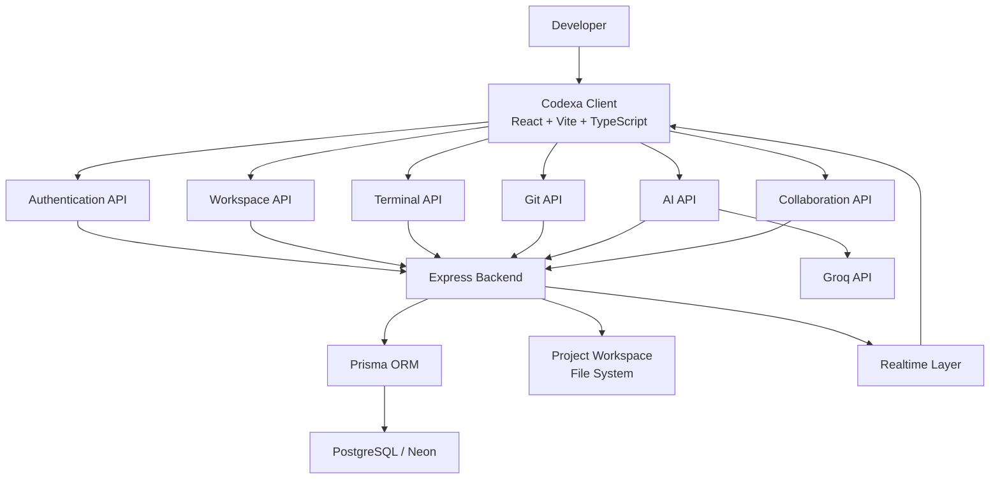

---

# 🔄 Codexa Request Flow

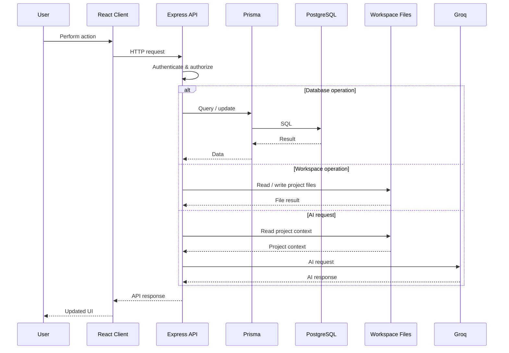

---

# 👤 User Journey

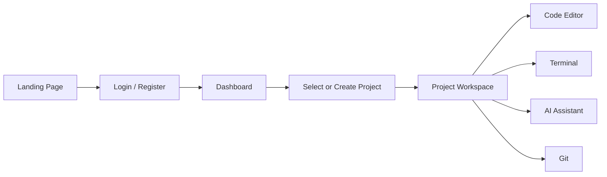

---

# 🔐 Authentication Flow

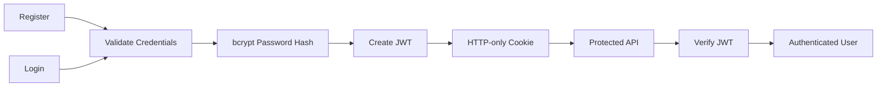

---

# 🤖 AI Architecture

Codexa keeps the AI provider on the server side.

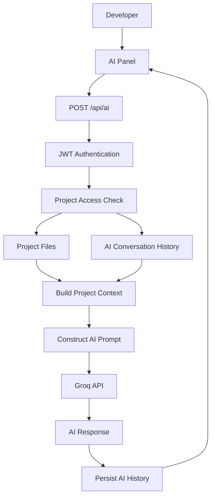

### Why backend-only AI?

The browser never needs the Groq secret.

```text
React Client
    |
    | AI request
    v
Express Backend
    |
    | GROQ_API_KEY
    v
Groq API
```

This keeps provider credentials outside the frontend bundle.

---

# 📁 Project Structure

```text
codexa/
│
├── client/
│   ├── public/
│   └── src/
│       ├── api/
│       ├── components/
│       │   ├── landing/
│       │   ├── workspace/
│       │   └── ui/
│       ├── pages/
│       │   ├── auth/
│       │   ├── Dashboard.tsx
│       │   ├── LandingPage.tsx
│       │   ├── Settings.tsx
│       │   └── WorkspacePage.tsx
│       ├── routes/
│       ├── store/
│       ├── types/
│       └── App.tsx
│
├── server/
│   ├── prisma/
│   │   ├── migrations/
│   │   ├── repair.sql
│   │   └── schema.prisma
│   │
│   ├── src/
│   │   ├── controllers/
│   │   ├── middleware/
│   │   ├── routes/
│   │   ├── services/
│   │   ├── utils/
│   │   ├── lib/
│   │   ├── realtime/
│   │   ├── app.ts
│   │   └── server.ts
│   │
│   ├── templates/
│   └── workspaces/
│
├── README.md
└── package.json
```

---

# 🔌 API Overview

## Authentication

| Method | Endpoint | Purpose |
|---|---|---|
| POST | `/api/auth/register` | Create account |
| POST | `/api/auth/login` | Login |
| POST | `/api/auth/logout` | Logout |
| GET | `/api/auth/me` | Get current user |
| PATCH | `/api/auth/me` | Update profile |

## Workspace

Workspace APIs handle project file operations and project-specific workspace access.

## Projects

Project APIs handle:

- Project creation
- Project retrieval
- Project updates
- Project deletion
- Project access
- Project members

## Terminal

```text
POST /api/terminal/:projectId/execute
```

Commands are authenticated and executed by the backend.

## AI

```text
/api/ai
```

AI requests are authenticated and project-scoped.

## Git

```text
/api/git
```

Git operations are handled through the backend.

---

# 🗄️ Database

Codexa uses PostgreSQL with Prisma ORM.

Core entities include:

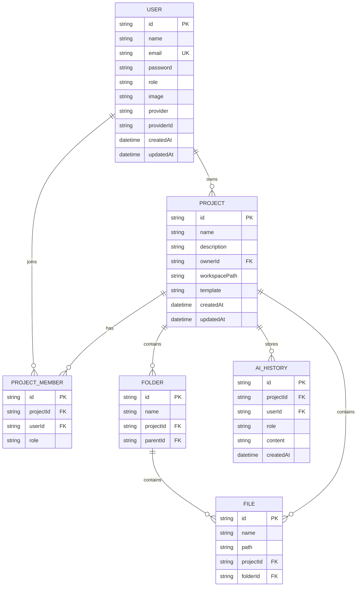

---

# 🧬 Prisma Migration Workflow

After changing the Prisma schema:

```bash
npx prisma migrate dev
```

To deploy existing migrations:

```bash
npx prisma migrate deploy
```

To check migration status:

```bash
npx prisma migrate status
```

To regenerate Prisma Client:

```bash
npx prisma generate
```

---

# 🔧 Environment Variables

Create the backend environment file:

```text
server/.env
```

Example:

```env
PORT=5000
DATABASE_URL=your_postgresql_connection_string
JWT_SECRET=your_long_random_secret
GROQ_API_KEY=your_groq_api_key
CLIENT_URL=http://localhost:5173
NODE_ENV=development
```

For production, use the production database and a strong secret.

**Never commit `.env` files or API keys to Git.**

---

# ▶️ Running Codexa Locally

## 1. Clone the project

```bash
git clone <your-repository-url>
cd codexa
```

## 2. Install dependencies

Install client dependencies:

```bash
cd client
npm install
```

Install server dependencies:

```bash
cd ../server
npm install
```

## 3. Configure environment

Create:

```text
server/.env
```

and configure:

```env
PORT=5000
DATABASE_URL=...
JWT_SECRET=...
GROQ_API_KEY=...
CLIENT_URL=http://localhost:5173
NODE_ENV=development
```

## 4. Prepare Prisma

```bash
cd server
npx prisma generate
npx prisma migrate deploy
```

## 5. Start backend

```bash
npm run dev
```

Backend:

```text
http://localhost:5000
```

## 6. Start frontend

Open another terminal:

```bash
cd C:\Users\Rutvi\codexa\client
npm run dev
```

Frontend:

```text
http://localhost:5173
```

---

# 🩺 Health Check

The backend exposes:

```text
GET /api/health
```

Expected response:

```json
{
  "success": true,
  "message": "Codexa Backend Running 🚀"
}
```

---

# 🔒 Security

Codexa uses several security measures.

### Authentication

- JWT authentication
- HTTP-only cookies
- bcrypt password hashing
- Protected API routes

### Authorization

Project access is checked using:

```text
Owner
Editor
Viewer
```

Users cannot access projects they are not authorized to access.

### Workspace Isolation

Each project gets a project-specific workspace path.

```text
server/
└── workspaces/
    └── <ownerId>/
        └── <projectId>/
```

Path validation prevents requests from escaping the project workspace.

### Terminal Security

The terminal does not expose an unrestricted shell API.

Commands are validated before execution and run with:

```text
shell: false
```

This reduces command-injection risk.

### AI Security

AI credentials remain on the backend.

The frontend never receives:

```text
GROQ_API_KEY
```

---

# ⚡ Runtime Architecture

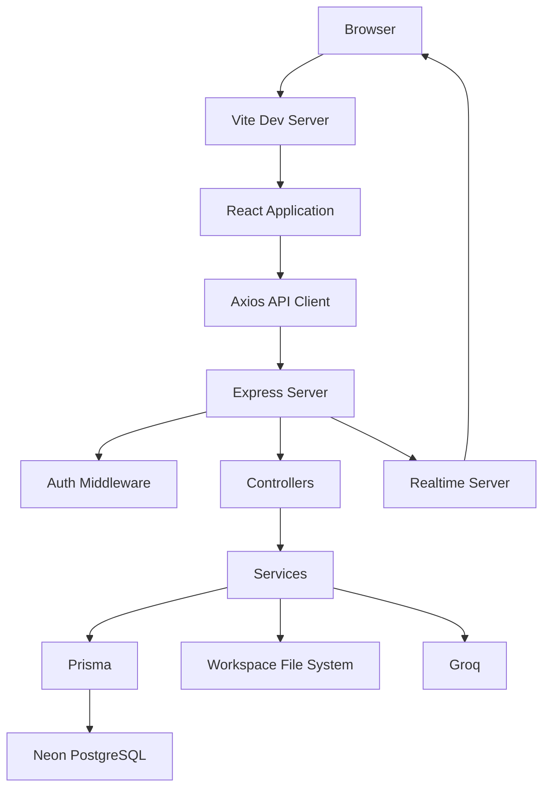

---

# 🧑‍💻 Development Workflow

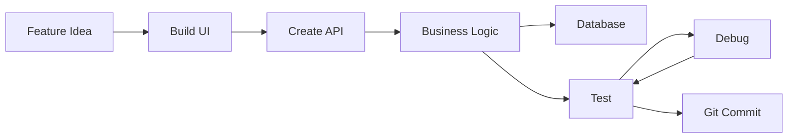

---

# 🔄 Project Workspace Lifecycle

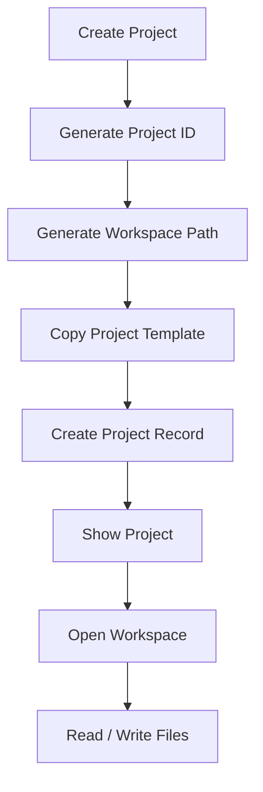

---

# 🧠 AI Coding Workflow

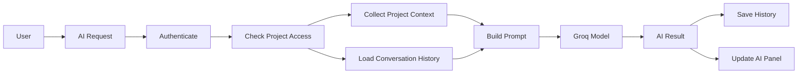

---

# 🧩 Workspace Components

The workspace is organized around several core areas:

```text
┌──────────────────────────────────────────────────────────────┐
│                        Codexa Workspace                       │
├───────────────┬───────────────────────────────┬──────────────┤
│               │                               │              │
│   Explorer    │          Code Editor          │ AI Assistant │
│               │                               │              │
│   Files       │          Monaco              │ Chat         │
│   Folders     │          Tabs                │ Context      │
│   Projects    │          Code                │ Suggestions  │
│               │                               │              │
├───────────────┴───────────────────────────────┴──────────────┤
│                         Terminal                              │
├──────────────────────────────────────────────────────────────┤
│                    Status / Workspace                         │
└──────────────────────────────────────────────────────────────┘
```

---

# 🧪 Testing Checklist

Before considering a feature complete, verify:

### Authentication

- [ ] Register works
- [ ] Duplicate email is rejected
- [ ] Login works
- [ ] Refresh preserves session
- [ ] Logout works
- [ ] Protected routes reject unauthenticated requests

### Projects

- [ ] Project creation works
- [ ] Project appears on dashboard
- [ ] Workspace opens
- [ ] Files persist after refresh
- [ ] Project access is enforced

### Editor

- [ ] File opens
- [ ] File can be edited
- [ ] Save works
- [ ] Saved code persists

### Terminal

- [ ] Command executes
- [ ] Output streams
- [ ] Invalid commands are rejected
- [ ] Project permissions are checked

### AI

- [ ] AI panel loads
- [ ] AI request succeeds
- [ ] Project context is available
- [ ] Conversation history persists
- [ ] File-edit responses are handled safely

### Collaboration

- [ ] Members can be listed
- [ ] Existing Codexa users can be invited
- [ ] Viewer permissions work
- [ ] Editor permissions work
- [ ] Unauthorized users are rejected

---

# 📊 Current Project Status

| Area | Status |
|---|---|
| Landing Page | ✅ Complete |
| Authentication | ✅ Complete |
| Session Restoration | ✅ Complete |
| Dashboard | ✅ Complete |
| Project Creation | ✅ Complete |
| Workspace | ✅ Working |
| File Editing | ✅ Working |
| File Persistence | ✅ Working |
| Terminal | ✅ Working |
| AI Assistant | ✅ Working |
| Database | ✅ Working |
| Prisma Migrations | ✅ Up to date |
| Git Integration | ✅ Implemented |
| Collaboration | ✅ Implemented |
| Production Deployment | 🔧 Deployment-ready architecture |

---

# 🧰 Useful Commands

## Frontend

```bash
cd client
npm run dev
```

## Backend

```bash
cd server
npm run dev
```

## Prisma

```bash
npx prisma generate
npx prisma migrate dev
npx prisma migrate deploy
npx prisma migrate status
```

## Git

```bash
git status
git add .
git commit -m "your message"
git push
```

## Build

Frontend:

```bash
cd client
npm run build
```

Backend:

```bash
cd server
npm run build
```

---

# 🚀 Production Architecture

Codexa is structured so the frontend and backend can be deployed independently.

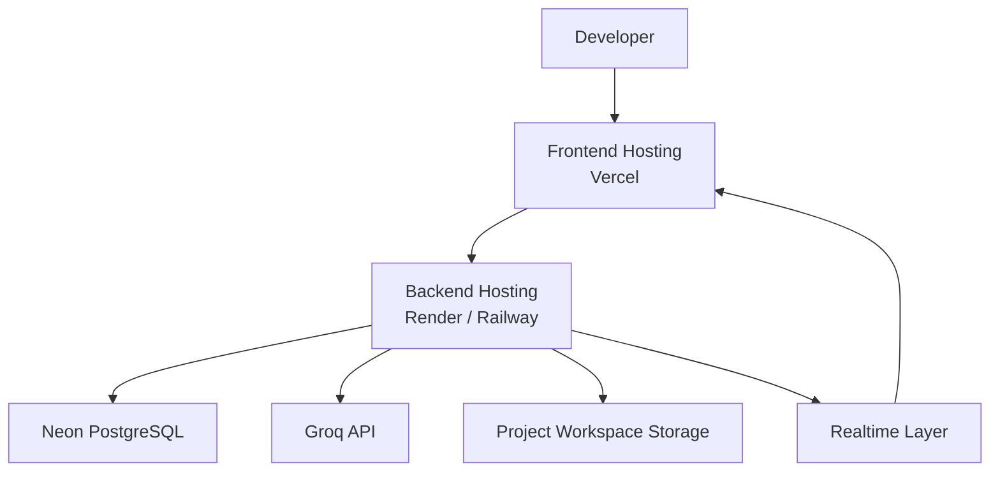

The production frontend should communicate with the production backend through an HTTPS API URL.

For example:

```env
VITE_API_URL=https://your-backend-domain/api
```

The backend should use production environment variables for:

```env
DATABASE_URL=...
JWT_SECRET=...
GROQ_API_KEY=...
CLIENT_URL=...
NODE_ENV=production
```

---

# 🌐 Client and Server Responsibilities

## Client

The React client is responsible for:

- UI
- Routing
- Forms
- Editor
- Workspace interactions
- API requests
- Local UI state
- AI chat presentation

## Server

The Express server is responsible for:

- Authentication
- Authorization
- Database operations
- File-system operations
- Terminal execution
- Git operations
- AI provider communication
- Collaboration logic
- Security validation

```text
CLIENT
  |
  | HTTPS API
  v
SERVER
  |
  ├── PostgreSQL
  ├── Workspace Files
  ├── Groq
  └── Realtime
```

---

# 🎯 Why Codexa?

Codexa combines several developer tools into one focused environment.

Instead of switching between:

```text
Browser
   ↓
Code Editor
   ↓
Terminal
   ↓
Git
   ↓
AI Assistant
   ↓
Project Management
```

Codexa brings the workflow together:

```text
                 CODEXA
                    │
       ┌────────────┼────────────┐
       ↓            ↓            ↓
     Editor       Terminal       AI
       │            │            │
       └────────────┼────────────┘
                    ↓
                 Project
                    │
                 Git / DB
```

---

# 📚 Learning Goals

Codexa was built to provide practical experience with:

- Full-stack development
- React architecture
- TypeScript
- REST APIs
- Authentication
- JWT
- HTTP-only cookies
- PostgreSQL
- Prisma
- File-system management
- Terminal process execution
- Git integration
- AI API integration
- Project-level authorization
- Real-time systems
- Cloud deployment architecture
- Secure API design

---

# 🏆 Project Highlights

### Full-stack architecture

Separate frontend and backend applications provide a scalable structure.

### Project isolation

Each project has its own workspace and access rules.

### AI context

The AI assistant can work with project-specific information instead of operating as a generic chatbot.

### Secure credentials

Provider API keys remain server-side.

### Persistent data

Projects, users, members, and AI history are stored through PostgreSQL.

### Developer-focused UI

The workspace is designed around the actual coding workflow rather than a generic dashboard.

---

# 👩‍💻 Author

**Rutvi Landge**

Codexa was built as a full-stack developer project to explore modern web development, developer tooling, AI integration, and scalable application architecture.

---

# 📄 License

This project is currently intended as a personal/portfolio project.

If you plan to open-source or distribute it, add the appropriate license file and update this section accordingly.

---

## ⭐ Codexa

> **Build. Code. Run. Collaborate. Let AI help.**

